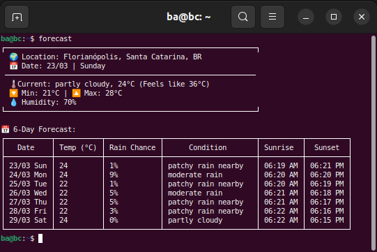

# Forecast CLI

A simple command-line tool to fetch and display weather forecasts using [WeatherAPI](https://www.weatherapi.com/) and location data from [ipinfo.io](https://ipinfo.io/).

Type `forecast` into your linux terminal and get a 6-day forecast to your current location.



## Author

I'm Barbara Calderon, a software developer.

- [Github](https://www.github.com/barbaracalderon)
- [Linkedin](https://www.linkedin.com/in/barbaracalderondev/?locale=en_US)
- [Twitter](https://www.x.com/bederoni)

## Features

- **Current Weather**: Displays the current weather conditions, temperature, humidity, and more.
- **6-Day Forecast**: Provides a detailed 6-day weather forecast, including sunrise and sunset times.
- **Location-Based**: Automatically detects your location using your IP address.
- **Easy Configuration**: Stores API keys and settings in a `.env` file for secure and flexible usage.

## About

What's the story behind this? Well, there actually is one.

One early Sunday morning, I woke up and jumped on the computer because I wanted to play around with some coding. I usually do this in the dark, with all the windows and doors closed shut and music pumping through my headphones. As you can see, I get very distracted.

About two hours in, I remembered I had to wash my laundry and hang the clothes out to dry in the sun in my backyard. Great! I got the laundry basket, detergent, fabric softener, and everything ready. Just as I was about to walk out the door of the building, I realized it had been raining hard.

How could I have missed this simple feature of nature? 

Oh, right... I hadn’t opened the window to my room because I was too distracted coding away on the computer.

This is meant to change that. It comes in handy for me since maybe I’m too lazy to open a web browser, search for a weather site, type in my location, and scan for the useful data I want. Every. Single. Time.

So, considering that the first webcam ever invented was designed to monitor a coffee pot so developers would know when to grab coffee instead of checking it when it wasn’t ready, I thought to myself... hey, why not?

That’s how Forecast CLI was created.

I hope you find it as useful as I do.

## Installation

### Prerequisites

- Go 1.21 or higher installed on your system
- API keys for [WeatherAPI](https://www.weatherapi.com/)

### Steps

1. **Clone the Repository**:
   ```bash
   git clone https://github.com/your-username/forecast-cli.git
   cd forecast-cli
   ```
2. **Set up the Configuration**:

- Create the config directory
```bash
mkdir -p ~/.config/forecast-cli
```

- Move the `.env` file to the config directory
```bash
mv /path/to/forecast-cli/.env ~/.config/forecast-cli/
```

3. **Edit the `.env` File:

- Open the `.env` file and add your API Keys from weatherapi.com
```bash
WEATHERAPI_API_KEY=your_weatherapi_key_here
```

4. **Edit the `.env` File:
```bash
go build -o forecast
```

5. **Install the Binary**:

- Move the binary to a directory in your `PATH` (e.g., `/usr/local/bin`):
```bash
sudo mv forecast /usr/local/bin/
```

### Usage

Run the `forecast` command to display the currect weather and 6-day forecast:
```bash
forecast
```

Example output:

```bash
┌────────────────────────────────────────────────────────────┐
│ 🌍 Location: Florianópolis, Santa Catarina, BR             
│ 📅 Date: 23/03 | Sunday                                    
├────────────────────────────────────────────────────────────┤
│ 🌡️ Current: partly cloudy, 24°C (Feels like 36°C)          
│ 🔽 Min: 21°C | 🔼 Max: 28°C                                
│ 💧 Humidity: 70%                                           
└────────────────────────────────────────────────────────────┘

📅 6-Day Forecast:
┌───────────┬───────────┬─────────────┬──────────────────────┬──────────┬──────────┐
│   Date    │ Temp (°C) │ Rain Chance │      Condition       │ Sunrise  │  Sunset  │
├───────────┼───────────┼─────────────┼──────────────────────┼──────────┼──────────┤
│ 23/03 Sun │ 24        │ 1%          │ patchy rain nearby   │ 06:19 AM │ 06:21 PM │
│ 24/03 Mon │ 24        │ 9%          │ moderate rain        │ 06:20 AM │ 06:20 PM │
│ 25/03 Tue │ 22        │ 1%          │ patchy rain nearby   │ 06:20 AM │ 06:19 PM │
│ 26/03 Wed │ 22        │ 5%          │ moderate rain        │ 06:21 AM │ 06:18 PM │
│ 27/03 Thu │ 22        │ 5%          │ patchy rain nearby   │ 06:21 AM │ 06:17 PM │
│ 28/03 Fri │ 22        │ 3%          │ patchy rain nearby   │ 06:22 AM │ 06:16 PM │
│ 29/03 Sat │ 24        │ 0%          │ partly cloudy        │ 06:22 AM │ 06:15 PM │
└───────────┴───────────┴─────────────┴──────────────────────┴──────────┴──────────┘
```

## Dependencies

The project uses the following services and libraries:

- WeatherAPI: For fetching weather data
- IpInfo.io: For detecting the user's location based on their IP Address
- Godotenv: For loading environment variables from the `.env` file

## Contributing

Contributions are welcome. If you'd like to contribute, please follow these steps:

1. Fork the repository
2. Create a new branch for your feature or bugfix
3. Submit a pull request with a detailed description of your changes

## License
This project is under the [GNU General Public Licence v3.0](https://choosealicense.com/licenses/gpl-3.0/)


## Version History

| Version | Date       | Description                                      |
|---------|------------|--------------------------------------------------|
| 1.0.0   | March 2025 | Launch of first version of Forecast-CLI. Type `forecast` to show 6-days forecast to your current location.|